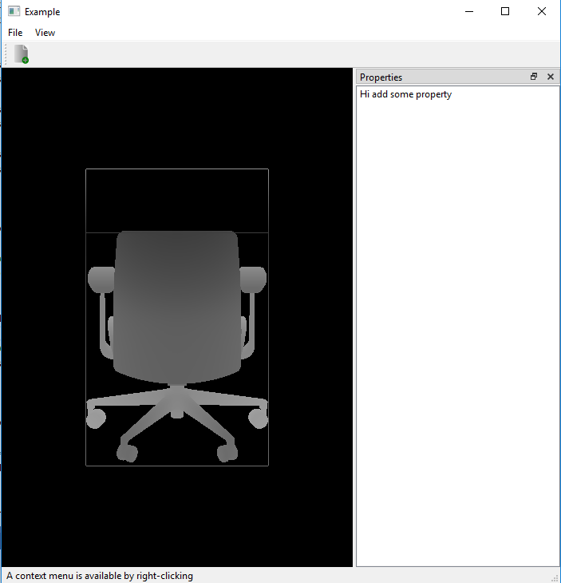

# 08_bounding_box

Draw Bounding Box (AABB) of 3D model:
  1) Model are loaded using plyreader
  2) AABB vertices, dimension are computed inside plyreader
      a) Centroid of Model is translated to origin
      b) Modeled is Scaled down with maximum value of AABB dimension
  3) GL_LINES primitive to draw the wireframe of bounding box
  4) Aspect ratio is computed from screen width and screen height
  5) Additional features
      a) Coloring is given according to depth of fragment
      b) Game loop is created with Qtimer
      c) Rotation of model is animated in the current model
  
Output Image:

